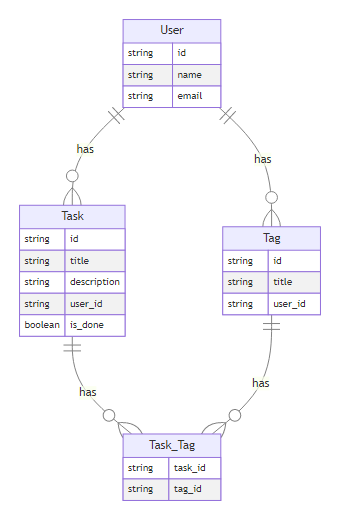
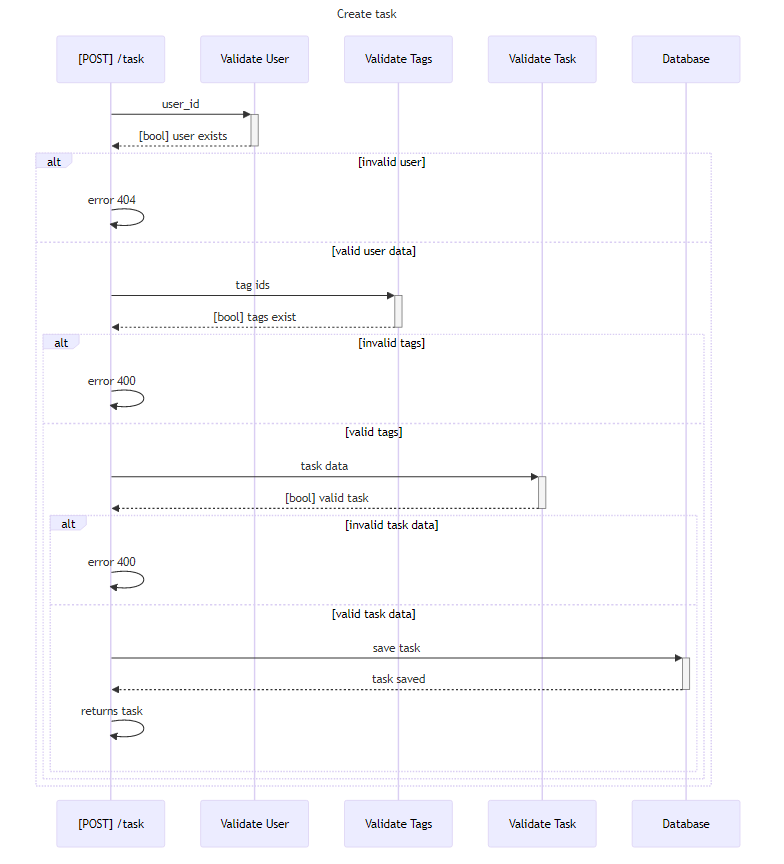
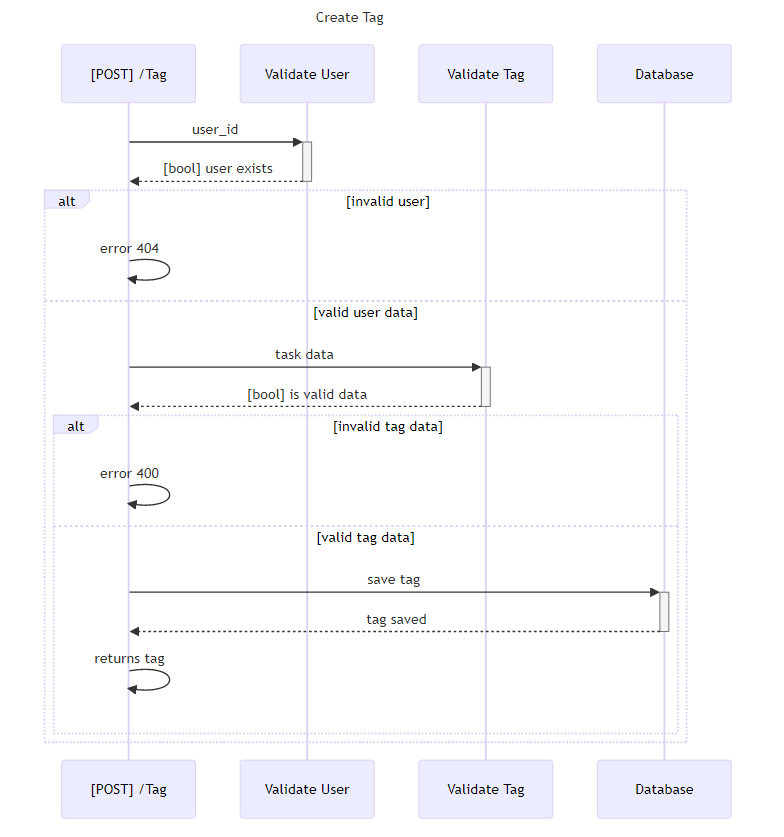

# Hello Kotlin

Um projeto simples para uma aplicação web que você poderia desenvolver é um "Gerenciador de Tarefas". 
Essa aplicação permite que os usuários criem, editem e removam tarefas, além de marcar tarefas como concluídas. 
Abaixo estão os principais requisitos para este projeto:

## Funcionalidades Principais:
- [ ] Autenticação de Usuário:
- [ ] Registro de novos usuários.
- [ ] Login e logout de usuários.
- [ ] Reset de senha via e-mail (opcional).

## Gerenciamento de Tarefas:

- [ ] Adicionar uma nova tarefa.
- [ ] Editar uma tarefa existente.
- [ ] Excluir uma tarefa.
- [ ] Marcar/desmarcar uma tarefa como concluída.
- [ ] Categorias/Tags: Permitir que o usuário categorize as tarefas com tags.

## Documentation

### ER Diagram

### Create task sequence diagram

### Create Tag sequence diagram

